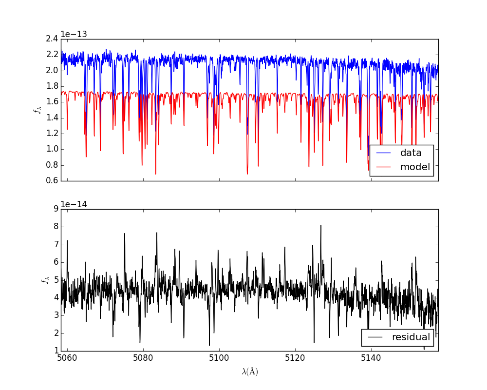
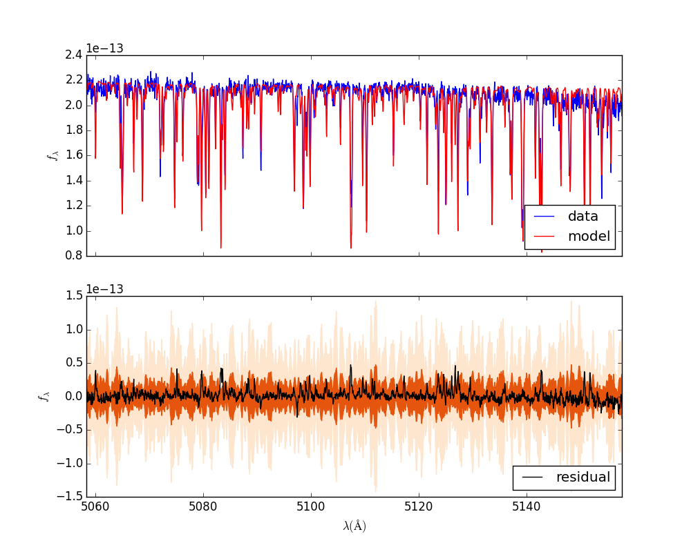

==============================
Example: WASP 14 Data Munging
==============================

Preamble
=========
In this example we will actually use data.  This example assumes you have already completed the spectral emulator example.

Set up the calibration parameters
==========================================

The first step is to generate default values for the (unknown) calibration parameters.

.. code-block:: bash

    $ star.py --initPhi

    $ ls
    PHOENIX_TRES_PCA.hdf5 eparams_fmin.npy      output
    config.yaml           libraries             plots
    data                  log.log               s0_o21phi.json

Notice that you've gained an s0_o21phi.json file:

.. code-block:: bash

    $ cat s0_o21phi.json
    {
      "cheb": [
        0.0,
        0.0,
        0.0
      ],
      "fix_c0": true,
      "l": 20.0,
      "logAmp": -13.6,
      "order": 21,
      "sigAmp": 1.0,
      "spectrum_id": 0
    }

This file contains the calibration parameters, :math:`\phi_{p}`, which are unique to each order.  In this case we are only modeling one order, number 21, so there is only one `phi.json` file.  If you model more orders, you will have one `phi.json` file per order.  As explained in Section 2.2 of Czekala et al. 2015, at least one order has to have a fixed :math:`c^{(0)}` term in order for the :math:`\Omega` term to not be completely degenerate, which explains the `fix_c0` term above.

Spot check your data and model parameters
==========================================

The next step is to spot check your data and model parameters.  You will need an educated guess for all of the stellar intrinsic and extrinsic parameters (:math:`\Theta = [\theta_{*}, \theta_{ext}]`).  The trickiest parameter to guess might be the unusual :math:`\Omega`, the solid angle subtended by the stellar disk as seen from Earth.  This parameter only carries physical significance if you have properly flux calibrated your spectrum, a process that is rarely performed for high-resolution slit spectroscopy.  Instead, most spectra are normalized so that the continuum level is unity, or the raw counts are in analog-to-digital units (ADUs).  So to start, you can guess any value for :math:`\log{\Omega}`, and check how bad your match is by blindly calculating the residual difference of model and data.

*n.b.* If you encounter an error message here, visit the troubleshooting page.

.. code-block:: bash

    $ star.py --generate
    keeping grid as is
    grid pars are [  6.10000000e+03   4.29000000e+00  -2.60000000e-01]

    $ ls
    PHOENIX_TRES_PCA.hdf5 eparams_fmin.npy      output                s0_o21spec.json
    config.yaml           libraries             plots
    data                  log.log               s0_o21phi.json

The new file `s0_021spec.json` contains the data, the model, the residual, and some other info.  At this stage, if your model is way off from the data, it is probably due to an errant :math:`\log{\Omega}` value.  Go to your `config.yaml` and manually edit this value to bring the model's mean level closer to the data.

.. code-block:: yaml
    :emphasize-lines: 5

    Theta :
        grid : [6100., 4.29, -0.26]
        vz : -4.77
        vsini : 5.79
        logOmega: -12.80
        Av: 0.0

Once your model is "in the ballpark" of the data, you can start to visualize the model and data spectra:

.. code-block:: bash

    $ splot.py s0_o21spec.json --matplotlib

    $ open plots/s0_o21spec.json.png

Not bad.  You can keep tweaking the **logOmega** value in `config.yaml` to get it to work out.  Add in a `--noise` flag to the `splot.py` command to get some nice uncertainty bands, to put your residual spectrum in context.

.. code-block:: bash

    $ star.py --generate; splot.py s0_o21spec.json --matplotlib --noise; open plots/s0_o21spec.json.png

Much better.  Now we're ready for optimization.  