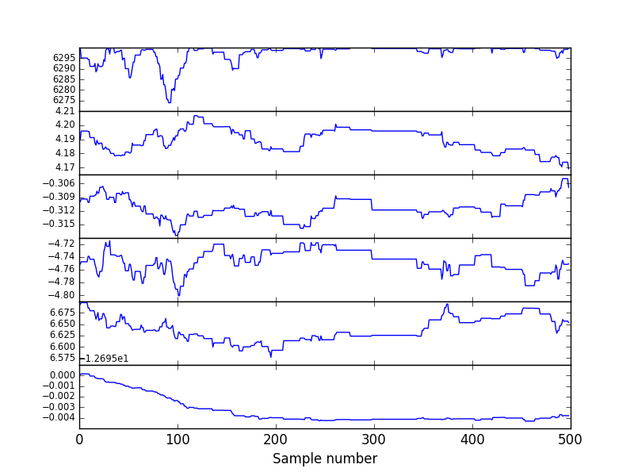
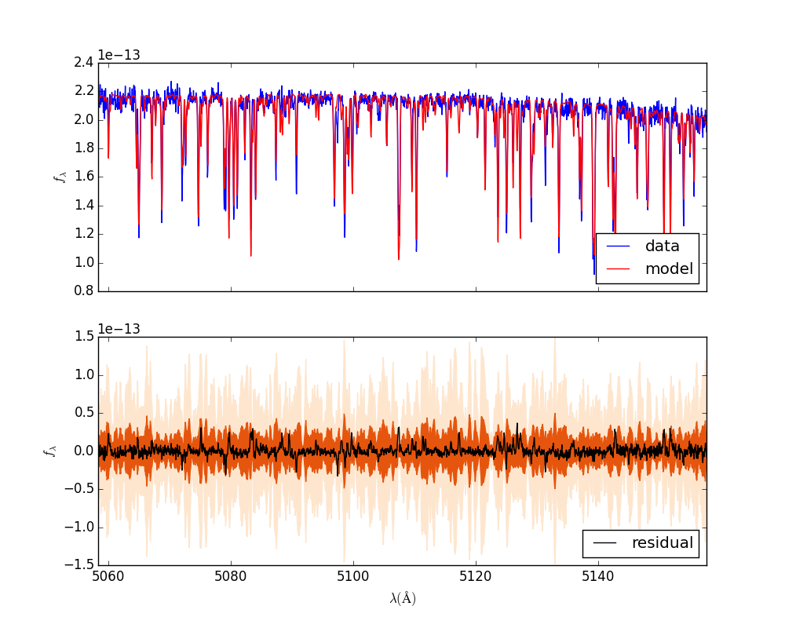

==============================
Example: WASP 14 Sampling
==============================

Preamble
=========
In this example we will actually perform MCMC sampling with the WASP14 data and stellar synthetic spectral model.  This example assumes you have already completed the two previous examples.

Optimize
==========================================

The first step is to iteratively run an optimization on the :math:`\Theta` and :math:`\phi_{P}` parameters.

.. code-block:: bash

    $ star.py --optimize=Theta
    keeping grid as is
    grid pars are [  6.10000000e+03   4.29000000e+00  -2.60000000e-01]
    grid:[  6.10000000e+03   4.29000000e+00  -2.60000000e-01] vz:-4.77 vsini:5.79 logOmega:-12.7 Av:0.0 lnp: 68337.603736
    grid pars are [  6.40500000e+03   4.29000000e+00  -2.60000000e-01]
    grid:[  6.40500000e+03   4.29000000e+00  -2.60000000e-01] vz:-4.77 vsini:5.79 logOmega:-12.7 Av:0.0 lnp: -inf
    grid pars are [  6.10000000e+03   4.50450000e+00  -2.60000000e-01]
    grid:[  6.10000000e+03   4.50450000e+00  -2.60000000e-01] vz:-4.77 vsini:5.79 logOmega:-12.7 Av:0.0 lnp: 68279.8923689

    [...]

    Optimization terminated successfully.
         Current function value: -69616.518919
         Iterations: 1333
         Function evaluations: 2074
    [  6.30000000e+03   4.19568653e+00  -3.10099805e-01  -4.75122506e+00
       6.69353314e+00  -1.26949259e+01]

The code spits out some information about the optimization, with :math:`\ln{p}` *increasing* for convergence.  This process is computationally intensive.  It saves a file `theta.json` with the best fit parameters.

.. code-block:: bash

    $ ls -t | head -n 2
    log.log
    theta.json

If you want, you can spot-check the optimization by generating residual plots again.  Otherwise, the next step is to optimize the :math:`\phi_{P}`.  This does not take as long.

.. code-block:: bash

    $ star.py --optimize=Cheb
    keeping grid as is
    grid pars are [  6.30000000e+03   4.19000000e+00  -3.10000000e-01]
    21 [ 0.  0.  0.  0.] 69616.4682918
    21 [ 0.00025  0.       0.       0.     ] 69614.5115122
    21 [ 0.       0.00025  0.       0.     ] 69607.5534798
    21 [ 0.       0.       0.00025  0.     ] 69602.4729821
    21 [ 0.       0.       0.       0.00025] 69621.2714096
    21 [ 0.000125  0.000125 -0.00025   0.000125] 69627.2303859
    21 [ 0.0001875  0.0001875 -0.0005     0.0001875] 69638.1985919
    21 [ 0.00021875 -0.00015625 -0.00025     0.00021875] 69637.4464359
    21 [ -4.68750000e-05   1.56250000e-05  -3.75000000e-04   3.28125000e-04] 69642.6705253
    21 [ -1.95312500e-04   2.34375000e-05  -5.62500000e-04   4.92187500e-04] 69655.4960311
    21 [  1.05468750e-04   2.73437500e-05  -6.56250000e-04   5.74218750e-04] 69659.6974336

    [...]

    21 [-0.00440223 -0.0182905  -0.0186727  -0.00466996] 70403.8324541
    Optimization terminated successfully.
             Current function value: -70403.832469
             Iterations: 123
             Function evaluations: 214
    21 [-0.00440322 -0.01828718 -0.01867513 -0.00466447]

    $ ls -t | head -n 1
    s0_o21phi.json

The code currently seems to have a bug: when a single order is optimized as shown above, the `phi.json` is incorrectly updated to flip `fix_c0 = false`.  There should only be 3 polynomial terms in this case, but instead 4 terms are shown.  I am not sure the origin of this problem.  Notably, it goes away when you run the code on multiple spectral orders.

Setting up an MCMC run
=======================

Once you have your `config.yaml` file and `*phi.json` files to a pretty close fit, the next step is to perform MCMC sampling.  But before we do that, we must change directories to the "run number".  The reason is that you probably want to re-run the chains with different starting values to make sure you have converged on a unique solution.  Besides, you might want to experiment by tweaking some other parameter and seeing how your results change (like turning on or off the local or global covariance kernels).  So you have to hand edit the file paths in your `config.yaml` file.  

.. code-block:: bash
    :emphasize-lines: 14, 28, 37

    $ cd output/example_wasp14/run01/

    $ cp ../../../s0_o21phi.json .

    $ mkdir plots

    $ cat config.yaml
    # YAML configuration script

    name: example_wasp14

    data:
      grid_name: "PHOENIX"
      files: ["../../../data/WASP14/WASP14-2009-06-14.hdf5"]
      # data/WASP14/WASP14-2010-03-29.hdf5
      # data/WASP14/WASP14-2010-04-24.hdf5
      instruments : ["TRES"]
      orders: [21]
      #orders: [20, 21, 22, 23, 24, 25, 26, 27, 28, 29, 30, 31, 32, 33, 34, 35, 36]

    outdir : output/

    plotdir : plots/

    # The parameters defining your raw spectral library live here.
    grid:
      raw_path: "/Users/gully/GitHub/Starfish/libraries/raw/PHOENIX/"
      hdf5_path: "../../../libraries/PHOENIX_TRES_test.hdf5"
      parname: ["temp", "logg", "Z"]
      key_name: "t{0:.0f}g{1:.1f}z{2:.1f}" # Specifies how the params are stored
      # in the HDF5 file
      parrange: [[6000, 6300], [4.0, 5.0], [-1.0, 0.0]]
      wl_range: [5000, 5200]
      buffer: 50. # AA

    PCA:
      path : "../../../PHOENIX_TRES_PCA.hdf5"
      threshold: 0.999 # Percentage of variance explained by components.
      priors: [[2., 0.0075], [2., 0.75], [2., 0.75]] # len(parname) list of 2-element lists. Each 2-element list is [s, r] for the Gamma-function prior on emulator parameters

Running MCMC
=======================
We can now run the MCMC. 

.. code-block:: bash

    $ star.py --sample=ThetaCheb --samples=500
    queried: -inf
    queried: -inf
    grid pars are [  6.30009519e+03   4.18633076e+00  -3.10247073e-01]
    proposed: [  6.30009519e+03   4.18633076e+00  -3.10247073e-01  -4.76870270e+00
       6.69265369e+00  -1.26949101e+01] -inf
    /Users/gully/GitHub/Starfish/Starfish/samplers.py:151: RuntimeWarning: invalid value encountered in double_scalars
      diff = newlnprob - lnprob0
    queried: -inf
    grid pars are [  6.30480812e+03   4.19077633e+00  -3.09505401e-01]
    proposed: [  6.30480812e+03   4.19077633e+00  -3.09505401e-01  -4.74348160e+00
       6.68660106e+00  -1.26949062e+01] -inf
    queried: -inf
    grid pars are [  6.29854048e+03   4.18474171e+00  -3.09595679e-01]
    proposed: [  6.29854048e+03   4.18474171e+00  -3.09595679e-01  -4.75665050e+00
       6.68735787e+00  -1.26949174e+01] 69888.9780735
    Calling acceptfn
    queried: 69888.9780735
    grid pars are [  6.30990092e+03   4.18330405e+00  -3.09893052e-01]
    proposed: [  6.30990092e+03   4.18330405e+00  -3.09893052e-01  -4.74432530e+00
       6.68470437e+00  -1.26946736e

    [...]

    Final [  6.29511725e+03   4.17353475e+00  -3.07618325e-01  -4.74908727e+00
   6.70671886e+00  -1.26955186e+01]

The chain of stellar parameters is stored in `mc.hdf5`.  The file `s0_o21phi/mc.hdf5` contains the chain for the calibration parameters.

.. code-block:: bash

    $ ls
    config.yaml    log.log        mc.hdf5        s0_o21         s0_o21phi.json

.. code-block:: bash

    $ chain.py --files mc.hdf5 --chain
    mc.hdf5 burning by 0 and thinning by 1
    Using a total of 1 flatchains

    $ open walkers.png

Sample with the covariance kernels
===================================

The next step is to sample in all of the parameters at once: :math:`\Theta, \phi_{P}, \phi_{C}`. 

.. code-block:: bash

    $ time star.py --sample=ThetaPhi --samples=500

    [...]

    Final [  6.22805414e+03   4.26403473e+00  -3.42007962e-01  -4.85008754e+00
   6.12838113e+00  -1.26980990e+01]

    real  6m22.483s
    user  21m41.059s
    sys 1m11.610s

It took about 6.3 minutes to run 500 samples on my Macbook pro.

Generate local kernels
=======================

Finally, we will generate local kernels.  We generate a `regions.json` file that lists the lince center locations of the spectral line residual outliers.

.. code-block:: bash

    $ regions.py s0_o21spec.json

    $ cat s0_o21regions.json
    {
      "mus": [
        5060.009630057251,
        5075.100425150731,
        5079.118048762344,
        5083.563995213442,
        5097.430362087737,
        5107.348576873876,
        5126.779372388678,
        5142.73291345833,
        5151.750303626388
      ],
      "order": 21,
      "spectrum_id": 0
    }

The next step is to optimize the properties of the line residual regions.  For each :math:`\mu` in the regions.json file, we determine the strength and the width:

.. code-block:: bash

    $ regions_optimize.py s0_o21spec.json
    Optimization terminated successfully.
             Current function value: -2566.567741
             Iterations: 44
             Function evaluations: 80
    [-14.22271954   3.83325534]
    Optimization terminated successfully.
             Current function value: -2817.582326
             Iterations: 38
             Function evaluations: 74
    [-13.66610645   4.34129446]
    Optimization terminated successfully.
             Current function value: -2846.075557
             Iterations: 40
             Function evaluations: 79
    [-13.79217763   4.16261911]
    
    [...]

    Optimization terminated successfully.
             Current function value: -3217.991389
             Iterations: 51
             Function evaluations: 93
    [-14.00434656   1.2655773 ]

This process updates the `s0_o21phi.json` file by adding a `regions` entry, with :math:`N` groups of amplitude, mean, and width. 

.. code-block:: bash

    $ cat s0_o21phi.json
    {
      "cheb": [
        -0.018,
        -0.0176,
        -0.004
      ],
      "fix_c0": true,
      "l": 20.0,
      "logAmp": -13.6,
      "order": 21,
      "regions": [
        [
          -14.222719540490553,
          5060.009630057251,
          3.833255335347469
        ],
        [
          -13.666106448038837,
          5075.100425150731,
          4.341294458239552
        ],
        [
          -13.792177629661296,

