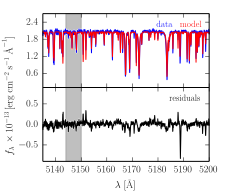
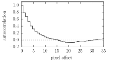
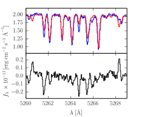
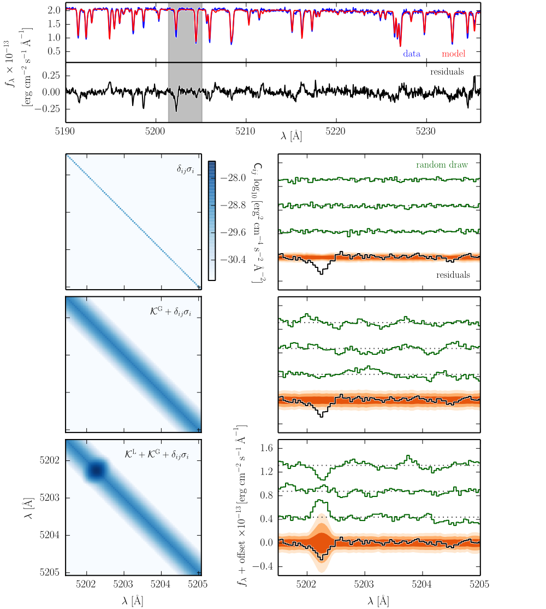
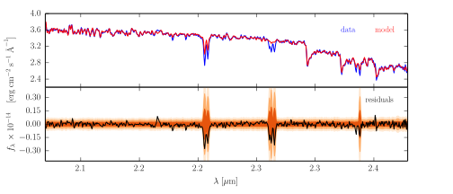
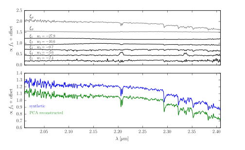

========
Overview
========

Deriving Physical Parameters from Astronomical Spectra
======================================================

**Consider the following scenario**: An astronomer returns from a successful observing trip with many high signal-to-noise,
high resolution stellar spectra on her trusty USB thumbdrive. If she was observing with the type of echelle spectrograph
common to most modern observatories, chances are that her data span a significant spectral range, perhaps the full optical (
3700 to 9000 angstrom) or the full near-infrared (0.7 to 5 microns). Now that she's back at her home institution,
she sets herself to the task of determining the stellar properties of her targets.

She is an expert in the many existing well-tested techniques for determining stellar properties, such as
`MOOG <http://www.as.utexas.edu/~chris/moog.html>`_ and `SME <http://www.stsci.edu/~valenti/sme.html>`_.
But the fact that these use only a small portion of her data—several well-chosen lines like Fe and Na—has stubbornly persisted
in the back of her mind.

At the same time, the astronomer has been paying attention to the steady increase in availability of high quality synthetic
spectra, produced by a variety of groups around the world. These libraries span a large range of the stellar parameters
she cares about (effective temperature, surface gravity, and metallicity) with a tremendous spectral coverage from the
UV to the near-infrared—fully covering her dataset. She wonders, "instead of choosing a subset of lines to study, what
if I use these synthetic libraries to fit *all of my data*?"

**She knows that it's not quite as simple as just fitting more spectral range**. She knows that even though
the synthetic spectral libraries are generally high quality and quite remarkable in their scope, it is still very hard
to produce perfect synthetic spectra. This is primarily due to inaccuracies in atomic and molecular constants that are
difficult to measure in the lab, making it difficult to ensure that all spectral lines are accurate over a wide swath
of both stellar parameters and spectral range. The highest quality libraries tend to achieve their precision by
focusing on a "sweet spot" of stellar parameters near those of the Sun, and by choosing a limited spectral range,
where atomic constants can be meticulously vetted for accuracy.

The astronomer also knows that some of her stars may
have non-solar ratios of elemental abundances, a behavior that is not captured by the limited set of adjustable parameters t
hat specify a spectrum in a synthetic library. She's tried fitting the full spectrum of her stars using a simple :math:`\chi^2`
likelihood function, but she knows that ignoring these effects will lead to parameter estimates that are biased and
have unrealistically small uncertainties. She wonders, "How can I fit my entire spectrum but avoid these pitfalls?"

Introducing *Starfish*: a General Purpose Framework for Robust Spectroscopic Inference
======================================================================================

We have developed a framework for spectroscopic inference that fulfills the astronomer's dream of using all of the data,
called Starfish. Our statistical framework attempts to overcome many of the difficulties that the astronomer noted.
Principally, at high resolution and high sensitivity, :ref:`model systematics<Fitting Many Lines at Once>`—such as
inaccuracies in the :ref:`strengths of particular lines<Spectral Line Outliers>`—will dominate the noise budget.

We address these problems by accounting for the covariant structure of the residuals that can result from fitting models
to data in this high signal-to-noise, high spectral resolution regime. Using some of the :ref:`machinery<Model the Covariance>` developed by the
field of Gaussian processes, we can parameterize the covariant structure both due to general line mis-matches as well
as specific "outlier" spectral lines due to pathological errors in the atomic and molecular line databases.

**Besides alleviating the problem** of systematic bias and spectral line outliers when :ref:`inferring stellar parameters<Marginalized Stellar Parameters>`,
this approach has many added benefits. By forward-modeling the data spectrum, we put the problem of spectroscopic
inference on true probabilistic footing. Rather than iterating in an open loop between stellar spectroscopists and
stellar modelers, whereby knowledge about the accuracies of line fits is communicated post-mortem, a probabilistic
inference framework like Starfish delivers posterior distributions over the locations and strengths of outlier spectral
lines. Combined with a suite of stellar spectra spanning a range of stellar parameters and a tunable list of atomic and
molecular constants, a probabilistic framework like this provides a way to close the loop on improving both the stellar
models and the stellar parameters inferred from them by comparing models to data directly, rather than mediating through
a series of fits to selected spectral lines.

Lastly, using a forward model means that uncertainties about other non-stellar parameters, such as flux-calibration or
interstellar reddening, can be built into the model and propagated forward. In a future version of Starfish we aim to
include a parameterization for the accretion continuum that "veils" the spectra of young T Tauri stars.

Fitting Many Lines at Once
==========================

Here is a general example of what can happen when one attempts to fit data with synthetic spectra over a wide spectral
range. This is an optical spectrum of WASP-14, an F star hosting a transiting exoplanet.

    A comparison of the data and a typical model fit, along with the corresponding residual spectrum. Notice that this
    residual spectrum does not look like pure white noise.

    A zoomed view of the gray band in the top panel, highlighting the mildly covariant residual structure that is
    produced by slight mismatches between the data and model spectra.

    The autocorrelation of the residual spectrum. Notice the substantial autocorrelation signal for offsets of 8 pixels
    or fewer, demonstrating clearly that the residuals are not well described by white (Poisson) noise alone.

Spectral Line Outliers
======================

Here is a specific example of individual lines that are strongly discrepant from the data. There is substantial localized
structure in the residuals due to "outlier" spectral lines in the model library. For any specific line, there might
exist a set of model parameters that will improve the match with the data, but there is no single set of model parameters
that will properly fit all of the lines at once.

Model the Covariance
====================
In order to account for the covariant residual structure which results from model systematics, we derive a likelihood
function with a non-trivial covariance matrix, which maps the covariances between pixels.

.. math::
    p(D|M) \propto \left| \det (C) \right|^{-1/2}\exp \left( -\frac12 R^T C^{-1} R \right)

We then parameterize this covariance matrix :math:`C` using Gaussian process covariance kernels. This procedure is demonstrated
in the following figure through the following decomposition of how the Gaussian process kernels contribute to the
covariance matrix.

**top panel**: a typical comparison between the data and model spectra, along with the associated residual spectrum.
The subsequent rows focus on the illustrative region shaded in gray.

The **left column** of panels shows the corresponding region of the covariance matrix :math:`C`, decomposed into its
primary contributions: (*top row*) the trivial noise matrix using just Poisson errors :math:`\delta_{ij}\sigma_i`,
(*middle row*) the trivial matrix combined with a "global" covariance kernel :math:`\kappa^G`, and (*bottom row*)
these matrices combined with a "local" covariance kernel :math:`\kappa^L` to account for an outlier spectral line.

The **right column** of panels shows the zoomed-in residual spectrum with example random draws from the covariance
matrix to the left. The shaded contours in orange represent the 1, 2, and 3 sigma dispersions of an ensemble of 200
random draws from the covariance matrix. Note that the trivial covariance matrix (*top row*) poorly reproduces both
the scale and structure of the residual spectrum. The addition of a global kernel (*middle row*) more closely
approximates the structure and amplitude of the residuals, but misses the outlier line at 5202.5 angstroms. Including
a local kernel at that location (*bottom row*) results in a covariance matrix that does an excellent job of
reproducing all the key residual features.

Robust to Outlier Spectral Lines
================================

*Starfish* uses Markov Chain Monte Carlo (MCMC) to explore the full posterior probability distribution of the stellar
parameters, including the noise parameters which describe the covariance of the residuals. By fitting all of the parameters
simultaneously, we can be more confident that we have properly accounted for our uncertainty in these other parameters.

**top** A K-band SPEX spectrum of Gl 51 (an M5 dwarf) fit with a `PHOENIX <http://phoenix.astro.physik.uni-goettingen.de/>`_ spectroscopic model. While the general
agreement of the spectrum is excellent, the strength of the Na and Ca lines is underpredicted (also noted by `Rojas-Ayala
et al. 2012 <http://adsabs.harvard.edu/abs/2012ApJ...748...93R>`_).

**bottom** The residual spectrum from this fit along with orange shading contours representing the distributions of
a large number of random draws from the covariance matrix (showing 1, 2, and 3 sigma).

Notice how the outlier spectral line features are consistently identified and downweighted by the local covariance kernels.
Because the parameters for the local kernels describing the spectral outliers are determined self-consistently along with
the stellar parameters, we can be more confident that the influence of these outlier lines on the spectral fit is
appropriately downweighted. This weighting approach is in contrast to a more traditional "sigma-clipping" procedure,
which would discard these points from the fit. As noted by `Mann et al. 2013 <http://adsabs.harvard.edu/abs/2013ApJ...779..188M>`_, some mildly discrepant spectral regions
actually contain significant spectral information about the stellar parameters, perhaps more information than spectral
regions that are in excellent agreement with the data. Rather than simply discarding these discrepant regions, the
appropriate step is then to determine the weighting by which these spectral regions should contribute to the total
likelihood. These local kernels provide exactly such a weighting mechanism.

Marginalized Stellar Parameters
===============================

The forward modeling approach is unique in that the result is a posterior distribution over stellar parameters. Rather
than yielding a simple metric of "best-fit" parameters, exploring the probability distribution with MCMC reveals any
covariances between stellar parameters. For this star with the above K-band spectrum, the covariance between
:math:`T_{eff}` and :math:`[Fe/H]` is mild, but for stars of different spectral types the degeneracy can be severe.

.. figure:: assets/stellar_triangle.svg
    :align: center
    :width: 90%

    The posterior probability distribution of the interesting stellar parameters for Gl 51, marginalized over all of
    nuisance parameters including the covariance kernel hyperparameters. The contours are drawn at 1, 2, and 3 sigma
    levels for reference.

Spectral Emulator
=================

For spectra with very high signal to noise, interpolation error from the synthetic library may constitute a significant
portion of the noise budget. This error is due to the fact that stellar spectral synthesis is an inherently non-linear
process requiring complex model atmospheres and radiative transfer. Unfortunately, we are not (yet) in an age where
synthetic spectral synthesis over a large spectral range is fast enough to use within a MCMC call. Therefore, it is
necessary to approximate an interpolated spectrum based upon spectra with similar stellar properties.

Following the techniques of `Habib et al. 2007 <http://adsabs.harvard.edu/abs/2007PhRvD..76h3503H>`_, we design a
spectral emulator, which, rather than interpolating spectra, delivers a probability distribution over all probable
interpolate spectra. Using this probability distribution, we can in our likelihood function analytically marginalize
over all probable spectral interpolations, in effect forward propagating any uncertainty introduced by the interpolation
process.

**top** The mean spectrum, standard deviation spectrum, and five eigenspectra that form the basis of the PHOENIX
synthetic library used to model Gl 51, generated using a subset of the parameter space most relevant for M dwarfs.

**bottom** The original synthetic spectrum from the PHOENIX library (:math:`T_{eff}=3000` K, :math:`logg=5.0` dex,
:math:`[Fe/H]=0.0` dex) compared with a spectrum reconstructed from a linear combination of the derived eigenspectra,
using the weights listed in the top panel.
